# Cross-Thread Ring Buffers Research Environment
 
Hey there! In the pursuit of research I decided to create a simple environment for testing new ring buffer implementations. Most of them are safe (some are designed to be unsafe) however this is primarily for educational purposes and a place to test new ideas before using them in production

This repository is intended to be used by other low latency enthusiasts so I've tried to make the code as modular as possible so that it's easy to add new ring buffer implementations. I've also included some notes throughout the code to help ease the process of adding new implementations

Along with the code, there's also a script which visualizes the results of the experiments. The two primary dependent variables I was interested in were throughput in bytes/ms and throughput in msgs/us. There are a few more metrics included in the results dump so feel free to play around with them

## Usage
 
- Most of the configuration options are in the main.rs file, so feel free to change the parameters to your liking before running the program
    - Setting `FULL_SUITE_TESTING` to true will run all the experiments under varying payload & ring size combinations (tons of data but costly to compile)

 ```bash
 rustup install nightly
 rustup default nightly
 cargo run --release
 ```

To analyze the results, open the `analyze_results.py` file and change the parameters to what you're interested in and run the script via
 ```bash
 python3 analyze_results.py
 ```

 ## Adding new ring implementations

 1. Decide which channel type you're interested in (SPSC is the simplest to start with)
 2. Clone one of the implementations (if you'd like to start from a baseline)
 3. Create new file under that channel type's folder
 4. Change the name of the ring to something unique
 5. Implement your targeted changes / tuning
 6. Add the ring details to rings/{channel_type}/mod.rs, rings/mod.rs, experiment.rs, full_suite_test.rs, and main.rs (notes are laid out for guidance)

There are some low-hanging fruit optimizations that can be made to some of the implementations, I'll leave them as an exercise to the reader ;)

# Example Results

### MPMC

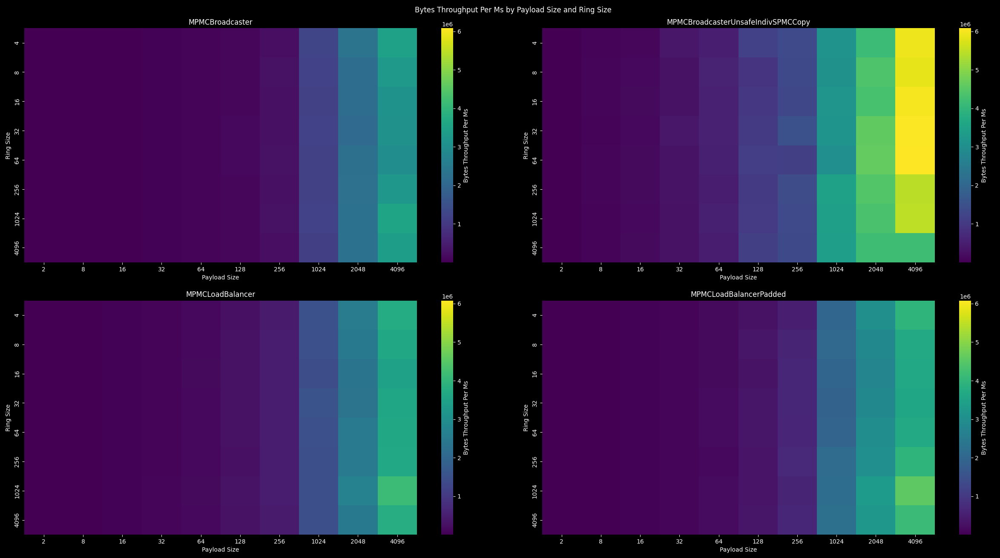
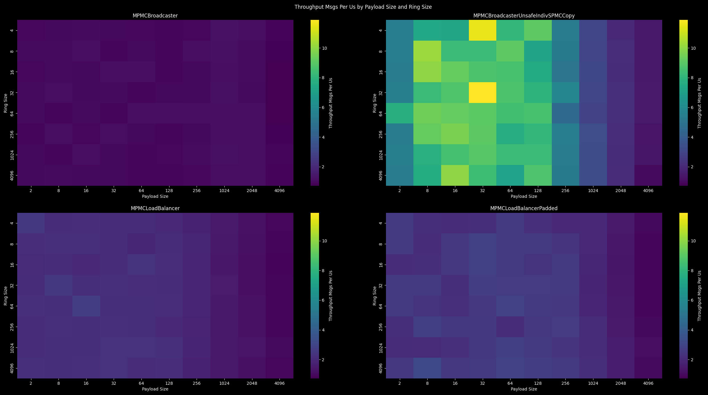
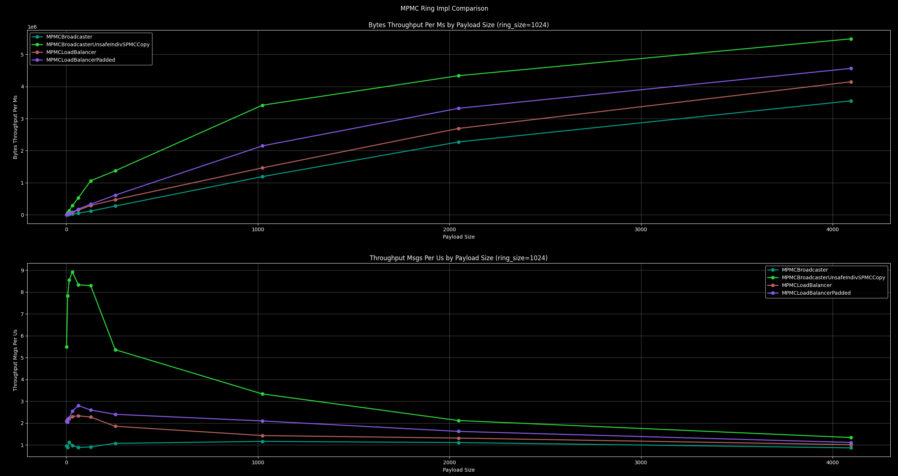
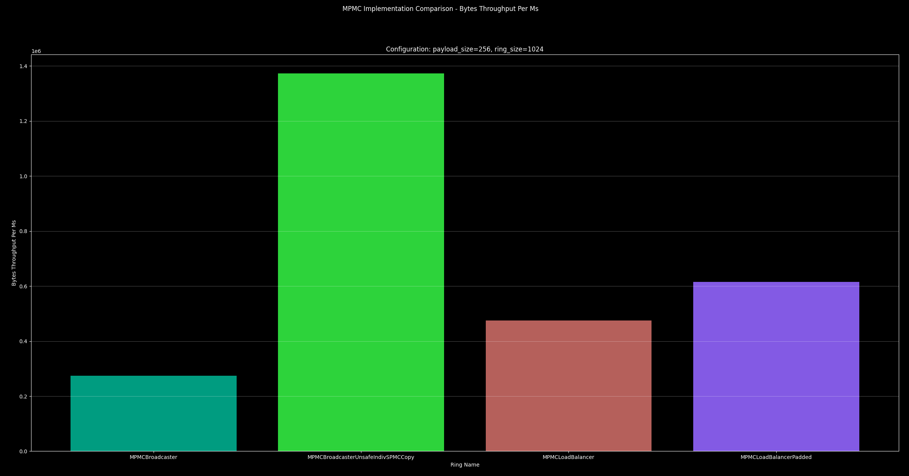

<hr>

### MPSC

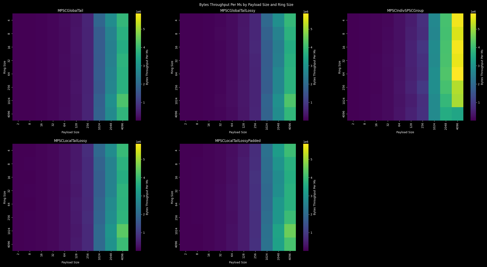

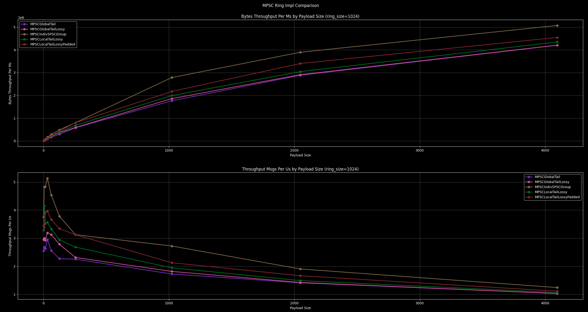
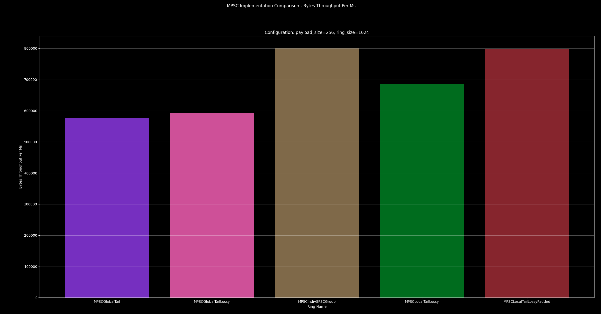

<hr>

### SPMC


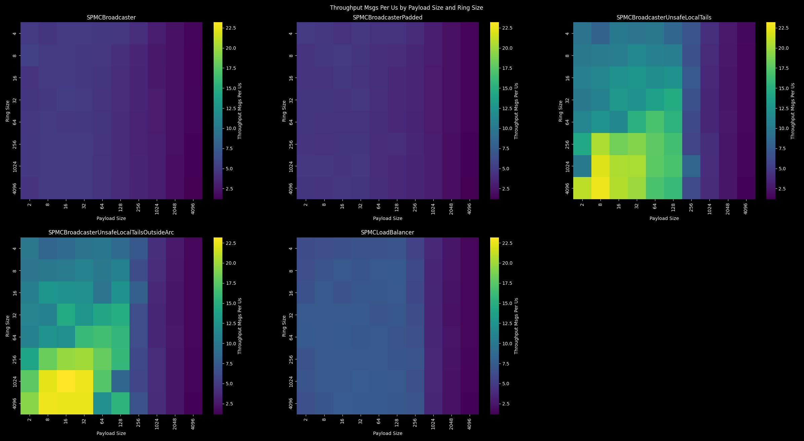
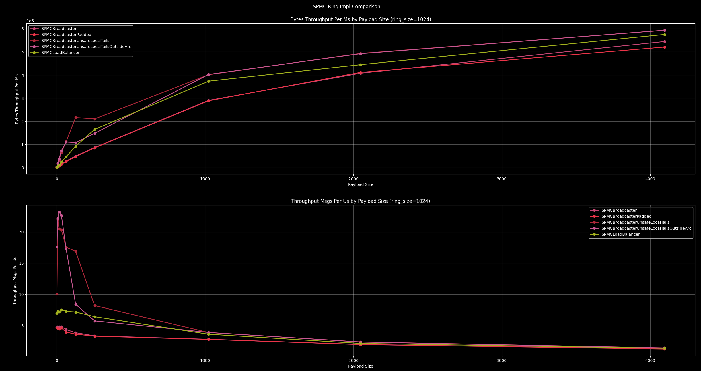
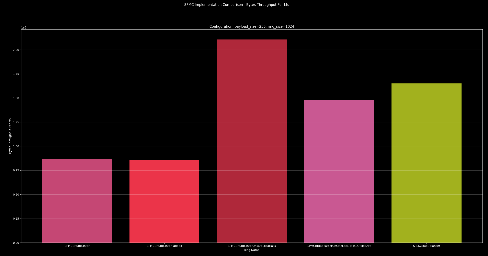

<hr>

### SPSC

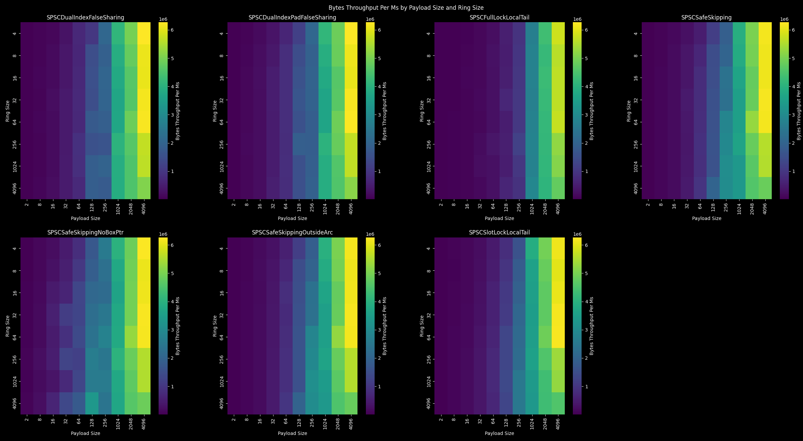
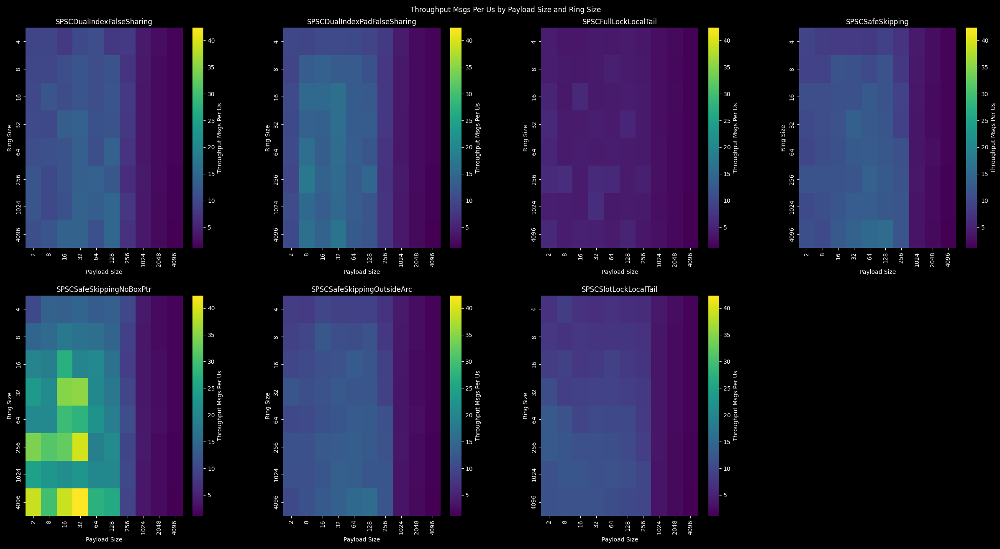
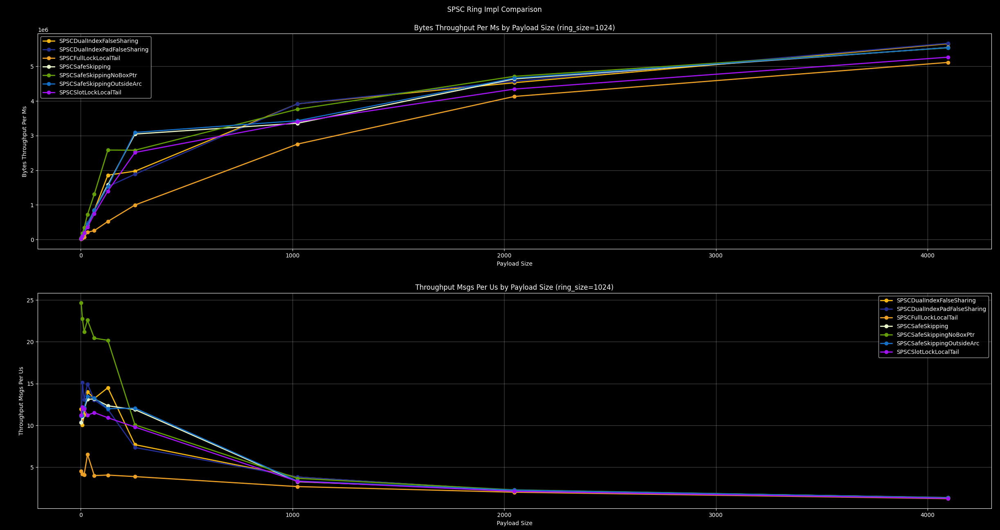
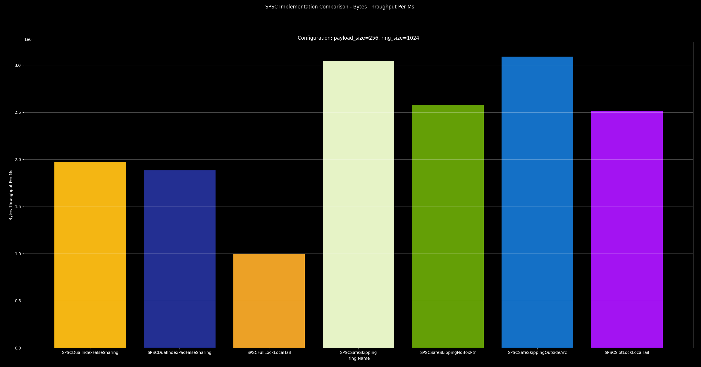


<hr>

I hope y'all enjoy and have some fun with this - Built by [Dub](https://x.com/Dub0x3A) | [CyclosResearch](https://x.com/CyclosResearch)